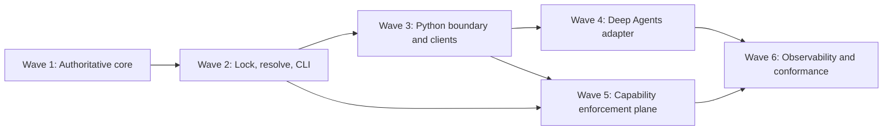

# Kiteframe V1 Wave Roadmap Implementation Plan

> **For agentic workers:** REQUIRED SUB-SKILL: Use superpowers:subagent-driven-development (recommended) or superpowers:executing-plans to implement this plan task-by-task. Steps use checkbox (`- [ ]`) syntax for tracking.

**Goal:** Land Kiteframe V1 alpha as six cumulative, reviewable waves with one authoritative portable core and a secure Deep Agents delivery.

**Architecture:** Rust owns the portable contract and every deterministic build decision. Python receives immutable Rust projections and supplies runtime-specific construction, while the capability provider performs dynamic admission and point-of-use authorization outside the portable core. Each wave publishes fixtures and interfaces consumed by the next wave; no wave claims safety properties assigned to a later gate.

**Tech Stack:** Rust 1.97.1, Cargo edition 2024, Python 3.11+, maturin/PyO3, Deep Agents 0.6.12, OpenFGA, OpenTelemetry, JSON Schema 2020-12, RFC 8785 canonical JSON, SHA-256.

## Global Constraints

- `agent.yaml` MUST NOT contain runtime code, executable import paths, endpoints, credentials, bearer grants, OpenFGA tuples, or deployment secrets.
- Rust is the single authority for parsing, exhaustive validation, containment, normalization, capability resolution, lock verification, hashes, feature negotiation, diagnostics, and `ResolvedAgent` construction.
- Portable core crates MUST NOT depend on Deep Agents, other runtime frameworks, OpenFGA, or OpenTelemetry SDK object types.
- V1 hashes use SHA-256, lowercase hexadecimal encoding, and a domain-separation prefix in the hashed bytes.
- Typed values are normalized as RFC 8785 canonical JSON; input and output schemas use JSON Schema 2020-12 and forbid remote `$ref` resolution.
- Absence is deny, explicit deny wins, and bindings, admission, and delegation may only narrow portable authority.
- Required unsupported semantics fail compilation; optional unsupported semantics produce a stable machine-readable warning in the compilation report.
- Every capability invocation is reauthorized at point of use. Cached admission never overrides revocation or stale policy.
- Every effectful invocation carries an idempotency key and obtains a durable write-ahead audit receipt before the effect executes.
- Telemetry content capture is disabled by default, and telemetry failure never changes authorization or invocation outcomes.
- The Deep Agents adapter is pinned to `deepagents==0.6.12` and upstream commit `196a0870fcf8a7f29d1fb37886dd323b190f9c16`.
- OpenHarness integration and second-runtime portability proof are V2 work and MUST NOT gate or expand V1.

---

## Wave Dependency Graph



Wave 5 can begin after Waves 2 and 3 while Wave 4 is under review. Wave 6 begins only after both runtime construction and provider enforcement have passed their independent gates.

## Spec Coverage

| Design area | Owning wave |
|---|---|
| Trust zones, exhaustive manifest/binding schemas, parser limits, containment, assets, nested packages | Wave 1 |
| Canonical JSON, domain-separated hashes, descriptor semantics, catalog resolution, locks, features, model roles, immutable IR, CLI | Wave 2 |
| Service contracts, immutable PyO3 values, generated stubs, component registry, strict provider HTTP client | Wave 3 |
| Pinned Deep Agents public API, typed tools, dynamic visibility, ambient denial, subagents, concurrency, suspension | Wave 4 |
| Admission, authority intersection, point-of-use checks, OpenFGA, freshness, evidence, preconditions, status, idempotency, audit, provider routes | Wave 5 |
| OpenTelemetry, privacy-gated capture, end-to-end failures, fuzz/restart/concurrency, requirement traceability, V1 release decision | Wave 6 |

## Wave Trackers

- [ ] **Wave 1 — Authoritative contracts and hostile package loading**
  - Plan: [`2026-07-25-kiteframe-v1-wave-1-authoritative-core.md`](2026-07-25-kiteframe-v1-wave-1-authoritative-core.md)
  - Exit: a Rust API loads a contained package, rejects hostile YAML and paths, emits normative schemas, and produces deterministic portable digests.

- [ ] **Wave 2 — Capability lock, deterministic resolution, CLI, and golden IR**
  - Plan: [`2026-07-25-kiteframe-v1-wave-2-lock-resolve-cli.md`](2026-07-25-kiteframe-v1-wave-2-lock-resolve-cli.md)
  - Exit: `kiteframe check`, `lock`, `explain`, and `compile` operate through one Rust pipeline; locked compilation emits canonical `ResolvedAgent` fixtures.

- [ ] **Wave 3 — Immutable Python boundary, component registry, and provider clients**
  - Plan: [`2026-07-25-kiteframe-v1-wave-3-python-contract.md`](2026-07-25-kiteframe-v1-wave-3-python-contract.md)
  - Exit: Python can receive but not forge or mutate Rust-owned IR, resolves only trusted registry symbols, and calls a fake capability provider through the standardized HTTP profile.

- [ ] **Wave 4 — Secure Deep Agents adapter**
  - Plan: [`2026-07-25-kiteframe-v1-wave-4-deep-agents.md`](2026-07-25-kiteframe-v1-wave-4-deep-agents.md)
  - Exit: the pinned public `create_deep_agent(...)` surface returns a `CompiledStateGraph`; built-ins and general delegation are default-denied; nested agents narrow authority; suspension requires durable checkpointing.

- [ ] **Wave 5 — Capability provider, OpenFGA, idempotency, and audit**
  - Plan: [`2026-07-25-kiteframe-v1-wave-5-enforcement-plane.md`](2026-07-25-kiteframe-v1-wave-5-enforcement-plane.md)
  - Exit: the HTTP provider separates admission from point-of-use checks, pins the OpenFGA model, validates results, orders audit before effects, and resolves retries through durable invocation status.

- [ ] **Wave 6 — Observability and end-to-end conformance**
  - Plan: [`2026-07-25-kiteframe-v1-wave-6-observability-conformance.md`](2026-07-25-kiteframe-v1-wave-6-observability-conformance.md)
  - Exit: the complete V1 failure matrix passes with stable trace/audit correlation, adversarial hardening, and requirement-to-test evidence.

## Cross-Wave Contract Freeze

The following names are frozen when their producing wave merges. A later wave may add fields only when the schema version and compatibility fixtures permit it.

| Producer | Contract | Consumers |
|---|---|---|
| Wave 1 | `Diagnostic`, `DiagnosticCode`, `AgentManifest`, `RuntimeBinding`, `AgentPackage`, `Sha256Digest`, `PackagePath` | Waves 2–6 |
| Wave 2 | `CapabilityDescriptor`, `CapabilityLock`, `ResolvedAgent`, `CompilationReport`, canonical fixture corpus | Waves 3–6 |
| Wave 3 | `PyResolvedAgent`, `FrozenComponentRegistry`, `AdmissionProvider`, `CapabilityInvoker`, `ProviderHttpClient` | Waves 4 and 6 |
| Wave 4 | `DeepAgentsAdapter`, `KiteframeSessionContext`, suspension envelope | Wave 6 |
| Wave 5 | `AuthorizationBackend`, `InvocationStore`, `AuditSink`, provider HTTP service | Wave 6 |

## Program-Level Verification

Run these commands after each wave merges:

```bash
rtk cargo fmt --all --check
rtk cargo clippy --workspace --all-targets --all-features -- -D warnings
rtk cargo test --workspace --all-features
rtk uv run --project python/kiteframe pytest
rtk uv run --project python/kiteframe-deepagents pytest
rtk git diff --check
```

Commands for projects not yet created in an earlier wave are added to CI only when that wave lands. Wave 6 adds the OpenFGA container suite, end-to-end suite, and fuzz smoke targets.

## Stop Conditions

- Do not begin Wave 1 runtime implementation until the design spec status is explicitly marked approved; creating these trackers does not itself land runtime code.
- Stop a wave when an exact interface from its prerequisite wave is missing; amend the producing plan instead of creating an alternate type.
- Stop Wave 4 if the pinned Deep Agents compatibility fixture cannot prove default denial without compilation-time process-global mutation.
- Stop effect execution when point-of-use policy is stale, required evidence is invalid, a precondition is missing, result validation fails, or the write-ahead audit append fails.
- Stop V1 release when a required conformance row lacks passing evidence; do not move the requirement to V2 merely to clear the gate.
