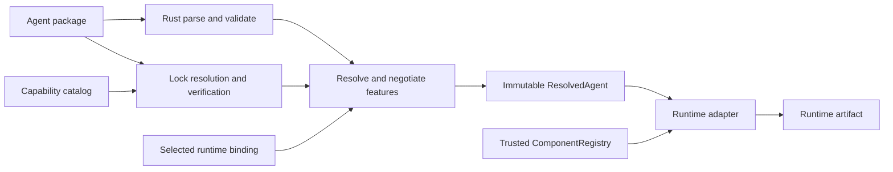
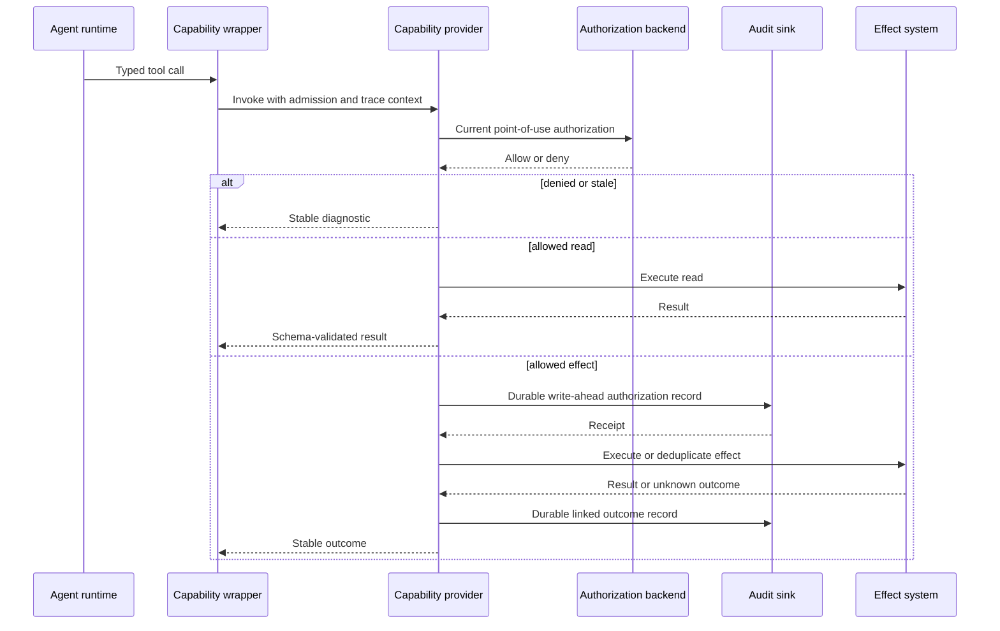

# Kiteframe Declarative Agent Harness Design

- **Status:** Draft for written review
- **Date:** 2026-07-25
- **Repository:** `swiftdiaries/kiteframe`
- **License:** Apache-2.0
- **Contract maturity:** V1 alpha

## Executive summary

Kiteframe is a Rust-first, runtime-neutral declarative layer for authoring,
validating, resolving, and compiling agent packages. It defines portable agent
packages and semantic capabilities without defining a workflow language or
owning an execution engine.

Authors describe an agent in a directory package. The portable package contains
an `agent.yaml` manifest, prompt and `SKILL.md` assets, nested agent packages,
runtime binding overlays, and a generated `capability.lock`. Rust is the source
of truth for parsing, exhaustive validation, capability resolution,
normalization, hashing, feature negotiation, diagnostics, and the immutable
`ResolvedAgent` intermediate representation.

The first runtime adapter targets Deep Agents. It converts resolved Kiteframe
values into the public `create_deep_agent(...)` construction API and returns a
`CompiledStateGraph`. OpenHarness is the second-runtime portability target and
the required portability spike before the portable contract can advance from
alpha to beta.

Kiteframe is fail-closed. Required semantics that a runtime cannot represent
fail compilation. Runtime bindings cannot add portable authority. Every
capability invocation is reauthorized at point of use. Effectful operations
require a durable write-ahead authorization record, and built-in filesystem,
shell, HTTP, MCP, and delegation facilities are unavailable unless explicitly
declared and authorized.

This document defines the founding contracts. It does not authorize runtime
implementation. Implementation planning begins only after written approval of
this committed design.

## Normative language

The key words **MUST**, **MUST NOT**, **REQUIRED**, **SHOULD**, **SHOULD NOT**,
and **MAY** are normative.

Examples illustrate the contracts but are not substitutes for the generated
schemas. Rust types and schemas generated from those types are the V1 source of
truth. When prose and a generated schema disagree, the discrepancy is a defect
and compilation MUST stop with a schema-version mismatch diagnostic.

## Problem statement

Agent frameworks combine portable intent with runtime-specific construction:
model objects, middleware classes, filesystem backends, checkpointers, tool
registries, and deployment credentials. A manifest that embeds those objects is
not portable. A manifest that omits their semantics invites adapters to guess,
silently drop requirements, or expose unsafe defaults.

Kiteframe creates a boundary between:

1. portable agent intent,
2. deployment-owned runtime bindings,
3. versioned semantic capabilities,
4. actor- and task-specific admission,
5. runtime construction and execution.

The boundary must be deterministic enough for reproducible builds and strict
enough that moving an agent between runtimes cannot silently weaken its
semantics.

## Goals

V1 has six goals:

1. Standardize a portable directory package for prompts, skills, nested agents,
   model roles, capability requirements, and safety requirements.
2. Produce a deterministic, immutable `ResolvedAgent` IR from package bytes,
   a capability lock, and a selected runtime binding.
3. Define versioned semantic capabilities independently of endpoints,
   credentials, policy engines, and transports.
4. Compile the same portable package through a Deep Agents adapter and prove
   the contract against a second OpenHarness adapter spike.
5. Make unsupported semantics, authorization denial, stale policy, invalid
   provider results, and audit failure typed and visible.
6. Provide correlation across compilation, runtime execution, capability
   providers, authorization, telemetry, and an independent audit ledger
   without capturing sensitive content by default.

## Non-goals

V1 explicitly does not provide:

- a workflow DSL, graph DSL, planner language, or execution engine;
- a production control plane or hosted agent platform;
- live policy authoring, publication, or policy-model migration control;
- arbitrary Python, Rust, JavaScript, shell, or module imports from manifests;
- package signing, provenance attestations, or a public package registry;
- a production OpenHarness adapter;
- provider-specific model configuration in the portable manifest;
- generic unrestricted HTTP, MCP, filesystem, or shell escape hatches;
- a replacement for OpenFGA or a requirement that deployments use OpenFGA;
- exactly-once execution across arbitrary external systems.

These exclusions are contract boundaries, not implied future commitments.

## Design principles

### Portable semantics, runtime-specific construction

The portable package states what the agent needs. A runtime binding states how a
trusted deployment realizes those needs. Provider model identifiers,
middleware classes, backend instances, checkpointers, endpoints, credentials,
and deployment topology belong only in bindings or deployment configuration.

### Rust is authoritative

Rust owns all decisions that must agree across languages: parsing, validation,
containment checks, normalization, resolution, lock verification, hashes,
feature negotiation, diagnostics, and IR construction. Python cannot reinterpret
or partially validate the portable contract.

### Deny by default and preserve semantics

Absence never grants authority. Deny wins over allow. Runtime adapters MUST NOT
silently discard declared semantics. A required unsupported feature fails
compilation. An optional unsupported feature is omitted only with a stable
machine-readable diagnostic recorded in the compilation report.

### Authority only narrows

Package requirements are an upper bound, not a grant. Deployment policy, actor
authority, task and session grants, catalog availability, delegation, policy
freshness, and point-of-use checks can only narrow that bound.

### Deterministic build, dynamic authorization

Package resolution and lock verification are deterministic. Actor authority,
task grants, revocation, confirmation, and policy freshness remain dynamic and
are evaluated when a session is admitted and again when a capability is used.

### No safety fallback

Provider or policy outages never cause fallback to unrestricted tools, direct
HTTP, MCP, shell, filesystem access, or a broader subagent. Telemetry export may
fail open; authorization and required audit writes fail closed.

## System context and trust boundaries

Kiteframe has five trust zones:

1. **Package input:** potentially untrusted YAML and referenced assets.
2. **Rust core:** trusted parser, validator, resolver, lock verifier, and IR
   producer.
3. **Deployment binding:** trusted configuration selecting pre-registered code
   objects and infrastructure.
4. **Runtime adapter:** trusted code mapping the IR into a runtime's public API.
5. **Capability plane:** providers, policy engines, audit storage, and external
   systems with independent failure modes.

The package parser MUST apply input-size, nesting-depth, collection-length, and
alias-expansion limits. It MUST reject duplicate YAML keys, non-UTF-8 text
assets, absolute paths, parent traversal, case-colliding paths, referenced
symlinks, and any resolved path outside the package root. Unknown fields are
errors unless a schema explicitly marks an extension map.

Bindings may name registry symbols but cannot provide import paths or executable
expressions. `ComponentRegistry` is populated by trusted deployment code.
Resolution of an absent or wrong-kind symbol fails before runtime construction.

## Component architecture

The implementation is divided by contract boundary:

| Component | Owns | Must not own |
|---|---|---|
| Rust core | Package parsing, schemas, validation, normalization, hashes, locks, resolution, feature negotiation, diagnostics, and `ResolvedAgent` | Runtime objects, credentials, actor policy, or execution |
| CLI | `check`, `lock`, `explain`, and IR `compile` presentation | Independent validation rules |
| PyO3 boundary | Immutable Python projections of Rust-owned values | Mutable alternate models or adapter policy |
| Runtime adapter | Public runtime construction and dynamic tool presentation | Portable semantics or authorization decisions |
| Component registry | Resolution of deployment-trusted symbolic objects | Manifest-driven imports |
| Capability provider | Catalog, admission, invocation, status, result validation, and point-of-use authorization orchestration | Agent workflow or model prompting |
| Authorization backend | Deployment policy decisions; OpenFGA is the reference | Capability semantic definitions |
| Audit sink | Durable append-only authorization and outcome records | Telemetry sampling or invocation |
| Telemetry pipeline | Traces, metrics, correlation, and optional classified content references | Authorization or required audit durability |

The dependency direction is one-way: adapters depend on the Rust contract;
portable core types never depend on Deep Agents, OpenHarness, LangChain,
OpenFGA, or OpenTelemetry SDK object types.

### Compilation flow



`compile` ends at the immutable IR when used through the CLI. In-process
adapter construction consumes that IR and returns a runtime artifact. No
runtime object is serialized back into the portable package.

### Invocation flow



## Agent package

### Directory layout

```text
support-agent/
├── agent.yaml
├── prompts/
│   └── system.md
├── skills/
│   └── case-summary/
│       └── SKILL.md
├── agents/
│   └── escalation/
│       ├── agent.yaml
│       ├── prompts/
│       │   └── system.md
│       └── bindings/
│           └── deepagents.yaml
├── bindings/
│   └── deepagents.yaml
└── capability.lock
```

Every nested agent is a complete package with its own `agent.yaml`. It MAY
inherit locked descriptor bytes from the parent lock, but it MUST declare its
own requirements and delegation boundary.

`capability.lock` is generated and MUST NOT be hand-edited. Runtime bindings are
packaged for distribution convenience but are not portable semantics.

### Portable manifest

The V1 manifest is exhaustive and versioned:

```yaml
apiVersion: kiteframe.dev/v1alpha1
kind: Agent
metadata:
  name: support-agent
  version: 0.1.0
spec:
  prompt:
    system: prompts/system.md
  skills:
    - skills/case-summary/SKILL.md
  models:
    primary:
      capabilities: [text, tool-calling]
      minContextTokens: 64000
    fast:
      capabilities: [text, tool-calling]
      maxLatencyClass: interactive
      required: false
  capabilities:
    - name: cases.read
      version: "^1.2"
      required: true
      resources:
        - "tenant:${context.tenant_id}/case:*"
    - name: cases.comment
      version: "^1.0"
      required: false
      resources:
        - "tenant:${context.tenant_id}/case:*"
  delegation:
    - agent: agents/escalation
      capabilities: [cases.read]
  features:
    required:
      - kiteframe.capability.point-of-use-auth@1
    optional:
      - kiteframe.capability.deferred@1
```

The manifest contains no workflow steps. Prompt text can describe behavior, but
prompt instructions do not grant capabilities, override confirmation, or alter
authorization.

### Model roles and constraints

`primary` is the only standard required model role in V1. Additional role names
are package-local symbolic names. Constraints are portable facts such as input
modalities, tool-calling support, structured-output support, minimum context,
residency class, and latency class.

A runtime binding maps each used role to a concrete provider model registered by
the deployment. If no registered model satisfies a required role, compilation
fails. Optional roles MAY fall back to `primary` only when `primary` satisfies
every constraint and the compilation report records the fallback. A binding
MUST NOT weaken constraints.

## Runtime binding

A binding is selected explicitly by target runtime and deployment:

```yaml
apiVersion: kiteframe.dev/binding/v1alpha1
kind: RuntimeBinding
metadata:
  runtime: deepagents
spec:
  models:
    primary: models.anthropic.sonnet
    fast: models.anthropic.haiku
  components:
    middleware:
      - middleware.tenant_context
    backend: backends.workspace
    checkpointer: checkpointers.durable
  capabilityProvider: capability-providers.primary
  auditSink: audit-sinks.ledger
```

Concrete provider IDs, model objects, middleware, backends, stores,
checkpointers, endpoints, credentials, transport settings, and deployment
configuration MUST remain outside `agent.yaml`.

A binding can satisfy or narrow portable requirements. It cannot add a
capability, resource selector, delegation edge, content-capture permission, or
effect allowance that the portable package did not declare.

## Foundational types

The schemas generated from these Rust-owned conceptual types are normative.
Fields shown here describe required responsibilities rather than final Rust
syntax.

### `AgentPackage`

```text
AgentPackage {
  root: CanonicalPackageRoot
  manifest: AgentManifest
  prompt_assets: Map<PackagePath, ValidatedTextAsset>
  skill_assets: Map<PackagePath, ValidatedTextAsset>
  subagents: Map<PackagePath, AgentPackage>
  bindings: Map<RuntimeName, RuntimeBinding>
  portable_digest: Sha256Digest
}
```

`AgentPackage` represents only validated, contained package content. Creation is
impossible when any referenced input is missing, duplicated, ambiguous, or
outside the root.

### `RuntimeBinding`

```text
RuntimeBinding {
  schema_version: BindingSchemaVersion
  runtime: RuntimeTarget
  model_symbols: Map<ModelRole, RegistrySymbol>
  component_symbols: TypedComponentSymbols
  provider_symbol: RegistrySymbol
  audit_sink_symbol: RegistrySymbol
  binding_digest: Sha256Digest
}
```

### `ResolvedAgent`

```text
ResolvedAgent {
  schema_version: IrSchemaVersion
  package_identity: PackageIdentity
  portable_digest: Sha256Digest
  lock_digest: Sha256Digest
  binding_digest: Sha256Digest
  resolved_digest: Sha256Digest
  prompts: ImmutablePromptAssets
  skills: ImmutableSkillAssets
  models: Map<ModelRole, ResolvedModelRequirement>
  capability_requirements: Vec<ResolvedCapabilityRequirement>
  subagents: Vec<ResolvedSubagent>
  required_features: FeatureSet
  optional_features: FeatureSet
  compilation_report: CompilationReport
}
```

`ResolvedAgent` contains no credentials, live actor grants, mutable runtime
objects, or executable imports. It is serializable as canonical JSON for golden
testing and process boundaries.

### `CapabilityDescriptor`

```text
CapabilityDescriptor {
  identity: CapabilityIdentity
  summary: String
  input_schema: JsonSchema2020_12
  output_schema: JsonSchema2020_12
  stable_errors: Vec<CapabilityErrorDescriptor>
  execution_modes: NonEmptySet<ExecutionMode>
  resource_selector_schema: ResourceSelectorSchema
  effect: EffectClassification
  idempotency: IdempotencyRequirement
  freshness: FreshnessRequirement
  preconditions: Vec<PreconditionDescriptor>
  confirmation: ConfirmationRequirement
  approval: ApprovalRequirement
  consent: ConsentRequirement
  descriptor_digest: Sha256Digest
}
```

### `CapabilityGrantSet`

```text
CapabilityGrantSet {
  admission_id: AdmissionId
  actor: ActorRef
  agent: AgentRef
  task: TaskRef
  session: SessionRef
  policy_revision: PolicyRevision
  catalog_digest: Sha256Digest
  issued_at: Timestamp
  expires_at: Timestamp
  grants: Vec<CapabilityGrant>
  grant_digest: Sha256Digest
}
```

Grant sets are immutable, time-bounded admission results. They are not bearer
credentials and do not replace point-of-use authorization.

### Service and adapter interfaces

```text
RuntimeAdapter {
  target() -> RuntimeTarget
  supported_features() -> FeatureSet
  validate(ResolvedAgent, RuntimeBinding) -> CompilationReport
  compile(ResolvedAgent, RuntimeBinding, ComponentRegistry)
    -> RuntimeArtifact | Diagnostic
}

ComponentRegistry {
  resolve(ComponentKind, RegistrySymbol) -> TrustedComponent | Diagnostic
}

CatalogProvider {
  catalog(CatalogRequest) -> CapabilityCatalog | Diagnostic
}

AdmissionProvider {
  admit(AdmissionRequest) -> CapabilityGrantSet | Diagnostic
}

CapabilityInvoker {
  invoke(InvocationRequest) -> InvocationOutcome | Diagnostic
  status(InvocationId) -> InvocationStatus | Diagnostic
}

AuditSink {
  append(AuditRecord) -> DurableAuditReceipt | Diagnostic
}
```

`RuntimeArtifact` is runtime-specific and cannot be placed back into the
portable IR. Implementations MUST NOT expose mutable global registries or mutate
process-wide harness profiles during compilation.

## Deterministic parsing, normalization, and hashes

Kiteframe uses SHA-256 for V1 interoperability. Hashes are lowercase hex and
always include a domain-separation prefix in the hashed bytes.

The pipeline is:

1. Discover only paths referenced by a validated manifest and its declared
   nested packages.
2. Enforce containment and input limits before reading full content.
3. Parse YAML with duplicate-key rejection.
4. Validate exhaustively against the selected schema version.
5. Convert typed values to RFC 8785 canonical JSON.
6. Hash each referenced asset's exact bytes and canonical path.
7. Construct the portable digest from canonical portable semantics plus the
   ordered asset and nested-package digests.
8. Verify the lock digest and every locked descriptor digest.
9. Resolve the selected binding and feature set.
10. Construct `resolved_digest` from portable, lock, binding, feature, and
    resolution-result digests.

YAML comments, key order, and scalar spelling that produce the same typed value
do not change the semantic manifest hash. Changes to referenced prompt or skill
bytes do change the portable digest. Runtime binding changes do not change the
portable digest but do change the resolved digest.

Diagnostics are deterministically ordered by stage, package path, source
location, and code.

## Capability lock

`capability.lock` records:

- lock schema version;
- portable package digest;
- catalog identity and immutable catalog digest;
- selected capability name and exact semantic version;
- descriptor digest;
- input and output schema digests;
- stable error-set digest;
- safety metadata digest;
- resolver version and feature set.

The resolver uses semantic-version constraints from `agent.yaml` and selects the
highest compatible catalog version unless a deployment policy narrows the
candidate set. Selection is deterministic over canonical catalog bytes.

Compilation with `--locked` MUST fail if:

- the package digest differs;
- a descriptor or schema digest differs;
- a selected version is absent;
- safety metadata changes without a version and lock update;
- the catalog is older than a required minimum revision;
- the resolver or lock schema is unsupported.

Kiteframe never substitutes a different compatible version during a locked
compile. `kiteframe lock` is the only command that updates the lock, and it
writes atomically after complete validation.

## Feature negotiation

Features use versioned identifiers. Adapters publish exact supported feature
versions. Negotiation has three outcomes:

- every required feature is supported: compilation may continue;
- an optional feature is unsupported: omit it and emit a stable warning;
- a required feature is unsupported or has an incompatible version:
  compilation fails.

Features include both portable semantics and runtime obligations, such as
point-of-use authorization, deferred invocation, checkpoint suspension,
dynamic tool visibility, and delegation narrowing.

Adapter-specific behavior is not inferred from runtime version strings.
Compatibility is an explicit feature-set comparison.

## CLI and Python boundary

The Rust CLI exposes:

- `kiteframe check`: parse and validate packages; `--locked` also verifies the
  lock without contacting a provider.
- `kiteframe lock`: resolve a catalog and atomically generate
  `capability.lock`.
- `kiteframe explain`: show resolution, feature negotiation, precedence, and
  diagnostics with secrets and tokens redacted.
- `kiteframe compile`: emit canonical `ResolvedAgent` JSON and validate a
  selected runtime target. It does not serialize a runtime graph.

All commands support structured JSON diagnostics and stable exit categories.
Human-readable rendering is a projection of the same diagnostics.

maturin/PyO3 bindings expose immutable Python views of Rust-owned values.
Python cannot construct a partially valid `ResolvedAgent`; it can only receive
one from successful Rust resolution or deserialize canonical IR that passes the
same Rust validation. Generated JSON Schemas and Python type stubs derive from
the Rust types.

## Capability semantics

### Identity and schemas

A capability name is a stable semantic operation such as `cases.comment`.
Semantic versions follow SemVer. A breaking change to inputs, outputs, error
meaning, resource selection, effect classification, idempotency, freshness,
preconditions, confirmation, approval, or consent requires a major version
change.

Inputs and outputs use JSON Schema 2020-12. Remote `$ref` resolution is
forbidden; all referenced schemas must be included in the canonical descriptor
bundle. Provider output is validated before it reaches the model or calling
agent.

Stable errors have a machine code, semantic category, retry class, and safe
public message. Provider-native errors are retained only in protected telemetry
or audit fields and cannot replace the stable error contract.

### Execution modes

V1 defines:

- `immediate`: returns a terminal result in the invocation response;
- `deferred`: returns an invocation ID and reaches a terminal state through
  status lookup;
- `suspendable`: may return a durable confirmation, approval, or consent
  suspension that is resumed from a checkpoint.

Streaming transport is not a portable V1 execution mode. A runtime MAY stream
presentation tokens, but capability completion still follows one of the modes
above.

### Effects and idempotency

V1 effect classes are:

- `read_only`;
- `reversible_write`;
- `irreversible_write`;
- `external_side_effect`.

Every class except `read_only` is effectful. An effectful descriptor MUST define
an idempotency contract and retention window. Every effectful invocation MUST
carry a caller-generated idempotency key scoped to actor, capability version,
resource, and semantic operation.

Kiteframe does not claim exactly-once delivery. When transport failure leaves an
outcome unknown, the adapter MUST query invocation status before retrying with
the same key. It MUST NOT issue a new key until the previous outcome is
terminally resolved or an authorized operator records an explicit abandonment.

### Resource selectors, freshness, and preconditions

Descriptors define the syntax and meaning of resource selectors but do not
contain deployment resource IDs or grants. A grant may only narrow selectors
declared by the package and descriptor.

Freshness metadata defines maximum admission age, policy revision requirements,
and any input-data freshness required for a safe decision. Preconditions are
typed, such as an entity version or ETag. Missing or stale required
preconditions fail before effect execution.

### Confirmation, approval, and consent

These are distinct:

- **Confirmation** is an explicit acknowledgement from the initiating user of
  a described action and concrete effects.
- **Approval** is authorization by a separately identified approver or policy
  role.
- **Consent** is permission from the data subject or governing consent record
  for a defined data use.

A descriptor states which are required and what evidence is valid. Prompt text
cannot satisfy them. Suspension requires durable checkpointing. On resume,
Kiteframe revalidates evidence, admission expiry, policy revision, resource
preconditions, and point-of-use authorization before executing.

### Descriptor exclusions

Descriptors MUST NOT contain endpoints, credentials, bearer grants, OpenFGA
tuples, transport configuration, deployment topology, or runtime code symbols.
Those values belong to providers, policy systems, bindings, or deployment
configuration.

## Capability provider HTTP profile

The first standardized provider profile uses:

```text
GET  /v1/capability-catalog
POST /v1/capability-admissions
POST /v1/capability-invocations/{name}
GET  /v1/capability-invocations/{invocation_id}
```

All requests use TLS and propagate W3C `traceparent` and `tracestate`. `baggage`
is restricted to a deployment allowlist and MUST NOT carry credentials,
prompts, arguments, results, or authorization tuples.

### Catalog

The catalog endpoint returns canonical descriptor bundles, catalog identity,
revision, digest, issued time, and optional expiry. It supports ETag-based
revalidation. A descriptor digest mismatch is a security failure, not a cache
miss.

### Admission

An admission request includes package and lock digests, actor, agent, task,
session, required and optional capability versions, requested resource
selectors, delegation ancestry, and relevant contextual facts. It does not send
runtime credentials from the package.

The response is an immutable, expiring `CapabilityGrantSet`. If any capability
marked required-for-session-start is not admitted, session construction fails.
Optional denied capabilities are absent and receive a stable diagnostic.

Admission filtering improves tool visibility and model guidance, but it is
never the final authorization decision.

### Invocation

An invocation request includes the admission ID, exact capability name and
version, typed arguments, selected resource, preconditions, idempotency key
when required, confirmation/approval/consent evidence references, and trace
context.

The provider:

1. validates request and result schemas;
2. reauthorizes against current policy;
3. verifies grant expiry, freshness, resource selection, evidence, and
   preconditions;
4. durably writes the authorization audit record for an effectful operation;
5. invokes or deduplicates the semantic operation;
6. durably records the outcome;
7. returns a terminal result, suspension, or invocation ID.

HTTP status codes are transport-level. The response body always uses the stable
Kiteframe outcome or diagnostic contract. Redirects to unconfigured origins are
forbidden.

### Status

Status lookup returns `pending`, `suspended`, `succeeded`, `failed`, `denied`,
or `outcome_unknown`, plus stable result or error data when terminal. Providers
must retain effectful invocation status for at least the descriptor's
idempotency retention window.

## Authorization model

### Visible capability envelope

For an actor, agent, task, and session:

```text
visible =
  agent requirements
  ∩ deployment policy
  ∩ actor authority
  ∩ task and session grants
  ∩ available locked catalog versions
```

Each term is a set of exact capability versions constrained by resource
selectors and conditions. Intersection applies independently to capability,
version, resource, effect, execution mode, expiry, and required evidence.

Precedence is unambiguous:

1. an explicit deny at any layer wins;
2. absence is deny;
3. a narrower selector, shorter expiry, stronger evidence requirement, or more
   restrictive effect rule wins;
4. a runtime binding cannot expand the package term;
5. admission cannot expand deployment or actor authority;
6. delegation can only narrow the parent's current effective envelope.

The model-visible tool list is a usability projection of this envelope. The
provider MUST reauthorize every invocation using current policy. Cached
admission never overrides revocation.

### OpenFGA reference provider

Kiteframe includes a real OpenFGA-backed reference provider. OpenFGA is
replaceable and does not define capability semantics.

The reference model represents actors, agents, tasks, sessions, capabilities,
and resources. It uses:

- actor-to-agent and actor-to-task relationships;
- task, agent, and session checks for capability use;
- contextual tuples to bind ephemeral task/session relationships;
- conditions for expiry and request context;
- `ListObjects` to filter candidate capability/resource objects during
  admission;
- `Check` for every invocation immediately before execution.

The reference provider pins the OpenFGA store and authorization model ID in
deployment configuration and includes the model ID and policy revision in
admission and audit records. A model migration invalidates incompatible cached
admissions. `ListObjects` results do not authorize execution; `Check` remains
mandatory.

The design follows OpenFGA's
[task-based authorization guidance](https://openfga.dev/docs/modeling/agents/task-based-authorization)
and
[authorization model configuration](https://openfga.dev/docs/getting-started/configure-model#step-by-step).

### Staleness and outage

Every admission has an expiry and maximum policy age. If a provider cannot
prove current-enough policy, required capability use fails with
`KF-AUTH-004 POLICY_STALE`. OpenFGA or provider outage never produces a broader
grant. Every read and effectful operation requires a current point-of-use
decision; an admission-time or cached visibility result is never sufficient.

## Deep Agents adapter

### Verified target

The V1 alpha adapter targets `deepagents==0.6.12` and the public
`create_deep_agent(...)` surface at upstream commit
[`196a0870fcf8a7f29d1fb37886dd323b190f9c16`](https://github.com/langchain-ai/deepagents/blob/196a0870fcf8a7f29d1fb37886dd323b190f9c16/libs/deepagents/deepagents/graph.py#L268).
The dependency is pinned by version and distribution hash in the implementation
lock. Supporting a different version requires a compatibility fixture and
explicit adapter feature declaration.

The thin Python adapter passes resolved model, tools, system prompt,
middleware, subagents, backend, store, checkpointer, and other supported public
arguments to `create_deep_agent(...)`. It returns the public
`CompiledStateGraph`. It does not call private functions or mutate a global
harness profile.

### Capability tools

Each admitted capability becomes a typed LangChain tool:

- name and description derive from the locked descriptor;
- arguments derive from the locked input schema;
- the wrapper selects a permitted resource;
- the wrapper carries admission, trace, and idempotency context;
- provider results are validated against the locked output schema;
- stable provider errors are mapped without exposing secrets.

Adapter-owned middleware computes model-visible tools for every model invocation
from the current grant set, expiry, task/session context, and suspension state.
Dynamic filtering is presentation and defense in depth; the provider's
point-of-use decision is authoritative.

### Built-in default denial

Deep Agents facilities are treated as capabilities, not ambient features.
Unless declared, locked, bound, and admitted:

- filesystem tools are unavailable;
- shell execution is unavailable;
- direct HTTP and MCP are unavailable;
- delegation is unavailable;
- the automatic general-purpose subagent is disabled.

The adapter MUST NOT restore a built-in as fallback after provider, policy,
registry, or middleware failure.

### Subagents and authority narrowing

Only declared nested packages are compiled. The adapter recursively compiles
each child with:

```text
child effective envelope
  = parent current effective envelope
  ∩ parent delegation declaration
  ∩ child requirements
  ∩ child admission
```

The child cannot receive a broader capability version, resource selector,
effect class, expiry, or evidence rule. Cycles and duplicate package identities
are errors. Delegation ancestry is included in authorization and audit context.

Subagent compilation and invocation use immutable per-session state. No global
registry or profile mutation is allowed, which prevents authority leakage
between concurrent agents.

### Suspension and checkpointing

Any package whose locked capabilities may require confirmation, approval, or
consent MUST bind a durable checkpointer. Missing checkpointing is a compilation
error. Suspension state stores only protected evidence references and
correlation IDs, not raw secrets. Resume performs the full authorization,
freshness, and precondition sequence again.

## Observability

Rust and Python emit OpenTelemetry traces and metrics. W3C trace context
propagates through the Deep Agents runtime, capability provider, and OpenFGA
client.

Kiteframe follows the pinned OpenTelemetry GenAI agent conventions for
`create_agent`, `invoke_agent`, and `execute_tool`. Because these conventions
are currently Development, Kiteframe also retains stable correlation attributes:

- `kiteframe.agent.name`
- `kiteframe.agent.package_digest`
- `kiteframe.agent.resolved_digest`
- `kiteframe.lock.digest`
- `kiteframe.runtime.adapter`
- `kiteframe.capability.name`
- `kiteframe.capability.version`
- `kiteframe.admission.id`
- `kiteframe.policy.revision`
- `kiteframe.invocation.id`
- `kiteframe.audit.record_id`

The pinned convention source is
[OpenTelemetry GenAI agent spans](https://github.com/open-telemetry/semantic-conventions-genai/blob/main/docs/gen-ai/gen-ai-agent-spans.md).
An implementation dependency update cannot rename or remove `kiteframe.*`
attributes within V1.

Prompt, message, tool argument, tool result, confirmation text, approval
evidence, and consent evidence capture are disabled by default. Opt-in capture
requires:

1. declared data classification;
2. field-level redaction;
3. deployment policy approval;
4. retention and access policy;
5. preferably external encrypted content storage referenced by opaque ID.

Telemetry exporter failure does not change authorization or invocation
outcomes. Telemetry backpressure MUST NOT block the effectful audit write path.

## Audit ledger

Audit is a separate, unsampled, append-only ledger. It is correlated with
traces through trace and span IDs but does not depend on successful telemetry
export.

For effectful operations, the provider MUST obtain a durable receipt for a
write-ahead authorization record before executing. The record includes:

- actor, agent, task, and session references;
- capability and exact version;
- normalized resource selector;
- admission ID and grant digest;
- policy revision and point-of-use decision reference;
- idempotency key;
- precondition and evidence references;
- package, lock, binding, and resolved digests;
- trace and span IDs;
- intended effect classification;
- timestamp and integrity-chain metadata.

After execution, the provider appends a completion, failure, suspension, or
outcome-unknown record linked to the write-ahead record.

Audit append failure blocks effect execution with `KF-AUDIT-001`. A successful
write-ahead record does not assert that the effect happened. Ledger integrity
uses sequence numbers and hash chaining per partition; production storage may
add stronger immutability controls without changing the interface.

## Diagnostics

Every diagnostic has:

```text
Diagnostic {
  code: DiagnosticCode
  category: DiagnosticCategory
  severity: Error | Warning
  stage: Parse | Validate | Lock | Resolve | Admit | Invoke | Audit | Runtime
  package_path: Optional<PackagePath>
  source_range: Optional<SourceRange>
  message: SafeMessage
  help: Optional<SafeMessage>
  retry: Never | AfterRefresh | AfterUserAction | StatusFirst
  details: RedactedStructuredDetails
}
```

V1 reserves these stable codes and meanings:

| Code | Name | Meaning |
|---|---|---|
| `KF-PKG-001` | `PACKAGE_INVALID` | Package syntax or schema is invalid. |
| `KF-PKG-002` | `PACKAGE_CONTAINMENT` | A path escapes, aliases, or ambiguously addresses the package. |
| `KF-LOCK-001` | `LOCK_STALE` | Package or catalog inputs no longer match the lock. |
| `KF-LOCK-002` | `LOCK_TAMPERED` | A locked descriptor, schema, or safety digest mismatches. |
| `KF-CAT-001` | `CATALOG_INCOMPATIBLE` | No locked compatible catalog version is available. |
| `KF-FEAT-001` | `FEATURE_UNSUPPORTED` | A required feature is unsupported by the target. |
| `KF-AUTH-001` | `ADMISSION_DENIED` | A required admission term is denied. |
| `KF-AUTH-002` | `ADMISSION_EXPIRED` | The admission grant set has expired. |
| `KF-AUTH-003` | `INVOCATION_DENIED` | Point-of-use authorization denied the operation. |
| `KF-AUTH-004` | `POLICY_STALE` | Current-enough policy could not be proven. |
| `KF-CAP-001` | `PRECONDITION_MISSING` | A required precondition is absent or stale. |
| `KF-CAP-002` | `RESULT_INVALID` | Provider output violates the locked schema. |
| `KF-CAP-003` | `OUTCOME_UNKNOWN` | Effect outcome must be resolved through status before retry. |
| `KF-AUDIT-001` | `AUDIT_UNAVAILABLE` | A required durable audit append failed. |
| `KF-RUNTIME-001` | `COMPONENT_UNRESOLVED` | A trusted registry symbol is absent or has the wrong kind. |
| `KF-RUNTIME-002` | `RUNTIME_CONSTRUCTION` | Public runtime construction failed. |

Codes are stable within V1. Messages may improve, but callers branch only on
codes and typed details. Diagnostics never include credentials, raw policy
tuples, prompts, arguments, or results by default.

## Reliability and failure semantics

The following rules are unconditional:

- Package or lock ambiguity stops compilation.
- Required unsupported features stop compilation.
- A required capability denied at admission stops session construction.
- Revocation hides future model visibility and denies point-of-use execution.
- Unknown effect outcomes require status resolution before retry.
- Missing durable checkpointing stops construction of suspendable agents.
- Invalid provider results never reach the model.
- Audit failure blocks effectful execution.
- Telemetry failure does not grant, deny, or broaden authority.
- Provider, OpenFGA, registry, middleware, or adapter failure never enables a
  built-in or unrestricted fallback.

## Verification strategy

### Rust core

Unit, property, and fuzz tests cover:

- YAML parsing limits and duplicate keys;
- path containment, symlinks, case collisions, and nested-package cycles;
- exhaustive schemas and unknown fields;
- canonical JSON normalization and deterministic hashes;
- semantic equivalence under YAML formatting changes;
- asset and lock tampering;
- catalog resolution and version ordering;
- safety metadata versioning;
- feature negotiation and diagnostic ordering.

Property tests assert that authority transformations are monotonic: adding a
restriction can never increase the effective envelope.

### Cross-language contract

Golden fixtures cover:

- Rust IR serialization;
- generated JSON Schemas;
- PyO3 immutable values;
- Python type stubs and round trips;
- diagnostic codes and redaction;
- identical package, lock, binding, and resolved digests.

Python cannot mutate an object and produce an IR that Rust would reject.

### Deep Agents adapter

Deterministic tests use fake models and providers to verify:

- capability tools match locked schemas;
- dynamic visibility follows admission, expiry, and revocation;
- undeclared filesystem, shell, HTTP, MCP, and general delegation are absent;
- required unsupported semantics fail;
- subagents receive strictly narrower authority;
- concurrent sessions cannot leak registries, grants, or middleware state;
- confirmation, approval, and consent suspend and resume through checkpoints;
- the adapter uses only the pinned public construction surface.

### OpenFGA reference provider

Container-backed tests cover:

- actor, task, agent, session, and resource relationships;
- `ListObjects` admission filtering;
- point-of-use `Check`;
- revocation after admission;
- contextual tuple binding;
- expiry conditions;
- authorization-model migration and admission invalidation;
- unavailable and stale policy behavior.

### Telemetry and audit

Tests verify:

- W3C propagation across Rust, Python, provider, and OpenFGA;
- pinned GenAI operations plus stable `kiteframe.*` attributes;
- content capture disabled by default;
- classification and redaction before opt-in capture;
- telemetry outage does not alter authorization;
- write-ahead ordering before effects;
- audit integrity chaining and trace correlation;
- audit outage blocks effects;
- completion and outcome-unknown records link to the authorization record.

### End-to-end scenarios

End-to-end fixtures cover:

- allowed read;
- admission denial and point-of-use denial;
- stale policy;
- confirmation suspension and resume;
- idempotent effect retry;
- unknown outcome followed by status resolution;
- deferred invocation;
- subagent narrowing;
- process restart and checkpoint resume;
- capability and lock tampering;
- provider and audit outages with no unsafe fallback.

### Portability gate

Before V1 moves from alpha to beta, a bounded OpenHarness adapter spike MUST:

1. consume the same golden `ResolvedAgent` fixtures;
2. implement the same capability and diagnostic contracts;
3. pass visibility, default-denial, delegation-narrowing, idempotency, and audit
   ordering tests;
4. document any runtime-specific gap without changing portable semantics.

The spike is not a production OpenHarness adapter. If the spike requires
Deep-Agents-specific concepts in `agent.yaml`, the portable contract remains
alpha and must be revised.

## Acceptance criteria for implementation planning

Written approval of this design requires agreement that:

- the portable manifest contains no runtime code or deployment secrets;
- Rust is the single validation and IR authority;
- hashes, locks, feature negotiation, and precedence are deterministic;
- capability descriptors contain semantics and safety metadata, not policy or
  transport configuration;
- session admission and point-of-use authorization are separate;
- OpenFGA is a replaceable reference implementation;
- Deep Agents built-ins are default-denied and the general subagent is disabled
  unless declared;
- subagent authority strictly narrows;
- confirmation, approval, and consent require durable suspension;
- effectful execution is idempotent and audit write-ahead is mandatory;
- telemetry content capture is off by default;
- safety claims have corresponding unit, integration, or end-to-end tests;
- the OpenHarness spike gates beta portability.

After written approval, this document will be marked approved and a single
implementation plan and OpenSpec change will become Kiteframe's sole task
tracker. Until then, no runtime code or implementation OpenSpec change is in
scope.
