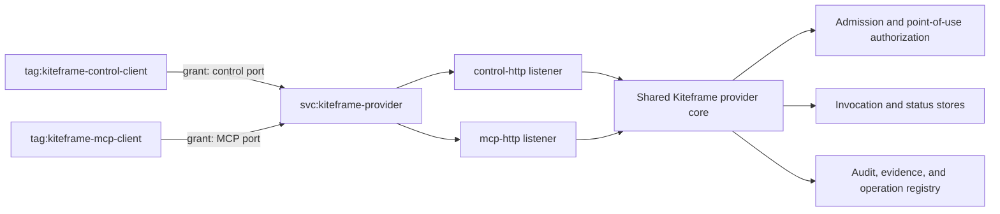

# Kiteframe Capability Control and MCP Design

- **Status:** Approved design; not yet implemented
- **Date:** 2026-08-05
- **Scope:** Capability-provider control API, MCP capability projection, and
  V1 private connectivity
- **MCP target:** Protocol revision `2026-07-28`, pinned to an audited schema
  revision until that release is stable
- **V1 connectivity:** Tailscale Service and tailnet grants

## Executive summary

Kiteframe will expose one provider authority through two narrowly scoped HTTP
listeners in one provider process:

1. a private control listener for catalog acquisition, admission, and
   operational status and recovery; and
2. an MCP listener for model-facing capability discovery and invocation.

This is not two competing transport stacks. MCP Streamable HTTP and the
control API share HTTP infrastructure, provider services, stores,
authorization, and audit. The listener split exists so that the two surfaces
can have independent network allowlists and application credential audiences
without duplicating capability semantics.

V1 uses one private Tailscale Service for provider reachability. Tailnet grants
allow control-client tags to reach only the control port and MCP-client tags to
reach only the MCP port. Tailscale supplies encrypted private connectivity and
network admission; Kiteframe still verifies its own workload and human
assertions and remains the sole authority for tenant correlation, admission,
grants, evidence, point-of-use authorization, audit, idempotency, and
invocation status.

MCP exposes an authorization-dependent projection of exact admitted semantic
capabilities. It does not replace Kiteframe's canonical capability catalog or
admission protocol. MCP tool names, annotations, metadata, request-state
handles, and visibility never confer authority.

## Context

Kiteframe already implements a provider profile with these routes:

- `GET /v1/capability-catalog`
- `POST /v1/capability-admissions`
- `POST /v1/capability-invocations/{name}`
- `GET /v1/capability-invocations/{invocation_id}`

The provider core already owns admission, point-of-use authorization,
invocation state, durable audit, idempotency, and status-first recovery. The
HTTP adapter calls inward into those services. The Python client and Deep
Agents integration currently consume the HTTP profile.

MCP revision `2026-07-28` can represent authorization-dependent tool listing,
exact JSON Schema inputs and outputs, tool calls, and multi-round input. It is
therefore a good model-facing projection for semantic capabilities. It is not
a replacement for trusted control-plane operations:

- `tools/list` is a caller-specific projection, not the full canonical
  capability catalog used for locking and resolution;
- admission must be initiated by a trusted host, not exposed as a
  model-controlled generic tool; and
- tool discovery metadata is not an authorization artifact.

The design narrows the existing HTTP surface instead of preserving two
complete public invocation protocols.

## Goals

- Keep one canonical Kiteframe provider authority and capability contract.
- Give trusted hosts a private catalog, admission, and recovery control API.
- Give agent hosts a standard MCP tool surface for semantic capability use.
- Isolate the control and MCP surfaces with independent tailnet grants and
  application credential audiences.
- Preserve current dual-principal correlation and point-of-use authorization.
- Keep the provider core independent of MCP and Tailscale.
- Migrate away from direct HTTP capability invocation without a flag day.
- Keep V1 deployment and conformance small enough to prove end to end.

## Non-goals

- Replacing Kiteframe workload or human identity with Tailscale identity.
- Treating tailnet tags, OAuth scopes, MCP metadata, or tool visibility as
  capability grants.
- Exposing generic `catalog`, `admit`, `invoke`, or `status` MCP tools.
- Supporting MCP Tasks, cancellation, or deferred task management in the
  initial slice.
- Projecting wildcard resources or mutating locked capability input schemas to
  add transport control fields.
- Making the Python Deep Agents adapter the protocol authority.
- Mandating an infrastructure-as-code runtime such as Pulumi.
- Requiring Linkerd, Istio, or multi-connectivity-plane conformance in V1.
- Defining or implementing Kiteframe's proposed per-request task-graph
  language. That remains a separate design concern.
- Supporting public Internet access to either listener in V1.

## Terminology

| Term | Meaning |
|---|---|
| Provider core | Rust services that own admission, invocation, authorization, audit, status, and operation dispatch. |
| Control listener | Private HTTP listener used by trusted resolvers and orchestrators. |
| MCP listener | MCP Streamable HTTP listener used by authorized agent hosts. |
| Tailnet identity | Tailscale node or service identity selected through users, nodes, or tags. |
| Kiteframe identity | Kiteframe-verified human and workload principals and their portable correlation references. |
| Projection | A caller-specific view derived from canonical descriptors, locks, admissions, and grants. |

## Decision and alternatives

### Selected: one process, two ports, one Tailscale Service

One composition process hosts a `control-http` listener and an `mcp-http`
listener. Both depend on the same provider services and stores. Port numbers
are deployment configuration; listener names and security roles are
normative.

One Tailscale Service, `svc:kiteframe-provider`, provides private stable
reachability to both ports. Tailnet grants independently authorize:

- `tag:kiteframe-control-client` to the configured control port; and
- `tag:kiteframe-mcp-client` to the configured MCP port.

An identity may carry both source tags only through an explicit reviewed
tailnet-policy change. Membership in one caller class never implies membership
in the other.

The port boundary is intentional. Tailscale grants enforce network access by
source, destination, protocol, and port; they do not need to understand HTTP
paths. Two listeners therefore give V1 a clear access boundary without a
service mesh or application proxy policy.

### Rejected: one listener with path-scoped policy

One port would reduce listener configuration, but Tailscale network grants
cannot distinguish `/v1/*` from `/mcp`. Adding a path-aware proxy would
reintroduce the complexity V1 is intended to remove.

### Deferred: Linkerd and Istio adapters

Linkerd or Istio can later protect the same two listener roles. They are
optional deployment adapters, not V1 release gates. This design does not
require their manifests, sidecars, certificate operations, or conformance
suites.

### Rejected: separate control and MCP deployments

Separate deployments provide stronger process isolation but duplicate
composition, scaling, readiness, store configuration, and operational work.
V1 does not need that cost because both adapters deliberately share one
authority kernel.

## Architecture

### Component boundaries

| Component | Responsibility | Must not own |
|---|---|---|
| `kiteframe-provider` | Admission, identity correlation, grant loading, point-of-use authorization, audit, invocation, status, and operation dispatch | HTTP, MCP, or Tailscale policy |
| `kiteframe-provider-http` | Control request parsing, HTTP error mapping, trace extraction, and calls into provider services | Alternate authorization or direct operation dispatch |
| `kiteframe-provider-mcp` | MCP negotiation, discovery, tool projection, tool-call translation, MRTR state, and MCP result mapping | Admission authority, grants, evidence authority, or direct operation dispatch |
| Provider composition process | Starts both listeners with shared services, stores, verifier configuration, and lifecycle | Capability policy or tailnet-policy management |
| Tailscale deployment configuration | Private service advertisement, source tags, port grants, and policy tests | Kiteframe principals, grants, or capability decisions |

The provider and contract crates must not depend on the MCP adapter. Both
transport adapters depend inward on provider services. Kiteframe source does
not import the Tailscale API or tailnet policy model.

## Listener contracts

### Control listener

The target control contract contains:

- `GET /v1/capability-catalog` for canonical catalog acquisition and cache
  validation;
- `POST /v1/capability-admissions` for trusted session/task admission; and
- `GET /v1/capability-invocations/{invocation_id}` for operational
  reconciliation and status-first recovery.

`POST /v1/capability-invocations/{name}` remains available only through an
explicit migration configuration. New deployments disable it by default, and
new consumers must use MCP `tools/call`. The route is removed after existing
Python and downstream consumers complete migration.

The control listener has no public route and accepts Kiteframe credentials
only for the `kiteframe-control` audience.

### MCP listener

The initial MCP contract contains:

- `server/discover`;
- `tools/list`;
- `tools/call`; and
- multi-round tool requests for suspendable operations.

The listener uses Streamable HTTP and accepts Kiteframe credentials only for
the `kiteframe-mcp` audience. The implementation pins the normative protocol
schema and records that source revision in conformance fixtures. It omits
fields that appear only in prose documentation when the normative schema does
not define them.

MCP Tasks are deferred. Until their lifecycle, cancellation behavior, Rust
support, and Kiteframe `outcome_unknown` mapping are resolved, operational
status remains authoritative in the provider and available through the
control listener.

## MCP capability projection

### Eligibility

An admitted capability is eligible for the initial MCP projection only when:

- its exact name and semantic version resolve through the active admission,
  grant, and lock;
- its input schema is an MCP-compatible object-root JSON Schema;
- its output schema is representable without modification; and
- the grant selects one concrete resource.

Non-object inputs and wildcard or runtime-selected resources are not silently
rewritten. They remain unavailable through MCP until a separately versioned
contract defines their representation.

### Tool identity

The adapter projects one tool for each exact `(capability name, version,
resource)` tuple. A deterministic wire alias contains a readable sanitized
prefix and an identity digest suffix. Full identity, descriptor digest, lock
digest, grant correlation, and concrete resource remain in a server-side
reverse lookup. Alias collision detection fails closed.

Tool metadata may include safe diagnostic correlation, but client-supplied
metadata never selects a version, resource, grant, or authorization context.
Annotations are model hints only.

### Listing

`tools/list` performs these steps on every request:

1. require connectivity through the MCP tailnet grant;
2. verify Kiteframe human and workload assertions for the MCP audience;
3. resolve an opaque, authenticated application context to the exact resolved
   agent, session, task, admission, grants, locks, and catalog snapshot;
4. validate tenant, principal, session/task, expiry, and current revisions;
5. project only eligible exact capabilities and concrete resources; and
6. return tools in deterministic order with private, authorization-bound
   caching.

The initial implementation uses zero cache TTL. Later caching may not outlive
the earliest token, catalog, grant, policy, or authority freshness boundary.
List-change notifications are an optimization, never revocation enforcement.

### Calling

`tools/call` performs these steps on every request:

1. require a connection admitted by the MCP tailnet grant and repeat
   Kiteframe authentication;
2. resolve the wire alias server-side to exact identity, version, descriptor,
   grant, and resource;
3. reject stale, unknown, colliding, or cross-context aliases;
4. validate arguments against the unchanged locked input schema;
5. create or recover the invocation identifier and idempotency key;
6. build `InvocationRequest` only from trusted stored context and validated
   arguments;
7. call the existing provider invocation service; and
8. let the provider perform current revision checks, evidence validation,
   final authorization, write-ahead audit, dispatch, output validation, and
   status persistence.

Stable capability failures return MCP tool errors. Malformed protocol
requests, unknown tool aliases, and transport failures return JSON-RPC errors.
Successful structured output conforms to the locked output schema.

### Suspension and resume

When the provider returns a validated suspension, the MCP adapter returns an
input-required result with a server-minted opaque request-state handle. The
handle is durable, expiring, replay-protected, and bound to the principal,
application context, original invocation, exact capability/resource,
arguments, preconditions, and proposal digest.

Client input is not itself approval or authorization evidence. A configured
trusted evidence issuer must convert accepted input into a protected evidence
reference. Resume reconstructs the original invocation and repeats provider
authentication and point-of-use authorization.

## Layered identity and access

Tailscale and Kiteframe answer different questions:

- Tailscale determines whether a tailnet identity may open a connection to a
  provider port; and
- Kiteframe proves the portable human/workload principals, agent, run,
  admission, task, session, tenant, and delegation correlations required for
  a capability decision.

Both checks are mandatory. Successful tailnet admission cannot construct a
`VerifiedWorkloadPrincipal`, and a valid Kiteframe credential cannot bypass a
tailnet denial.

Every provider request continues to carry both Kiteframe principal classes.
Any future non-human control principal is a separate contract change and is
not inferred by this design.

The two application audiences provide defense in depth:

- `kiteframe-control` on the control listener; and
- `kiteframe-mcp` on the MCP listener.

Cross-listener credential replay therefore fails even if a tailnet grant is
accidentally broadened.

Tailscale identity headers or metadata, when present, are diagnostic only.
They never create Kiteframe identity, choose a grant, or alter an invocation.

## V1 private-connectivity requirements

- One private Tailscale Service advertises both configured provider ports.
- The provider has no public ingress or direct public fallback.
- Source tags have reviewed `tagOwners`.
- Tailnet grants are deny-by-default and name exact source tags, the provider
  service, and the allowed port.
- Control and MCP grants are separate policy entries.
- Tailnet policy includes automated accept and deny tests for both caller
  classes.
- Tailscale configuration is Git-reviewed alongside deployment configuration.
- A Tailscale outage must not cause traffic to fall back to an unprotected
  address.

The design does not require a particular hosting mechanism for the Tailscale
Service. A direct service host, `tsnet`, or the Tailscale Kubernetes Operator
may advertise it as long as the same identity, grant, and no-public-fallback
requirements hold. If a shared Kubernetes egress proxy collapses multiple pods
into one tailnet identity, the deployment must use separate proxies/tags for
the two caller classes or rely on directly tagged caller nodes. Kiteframe
identity remains authoritative inside either class.

## Request flows

### Catalog and admission

1. A control-tagged resolver or orchestrator connects to the control port of
   `svc:kiteframe-provider`.
2. The tailnet grant permits the connection.
3. Kiteframe verifies both principals and the control audience.
4. The HTTP adapter calls the existing catalog or admission service.
5. The provider returns the canonical catalog or immutable, expiring grant
   set.

### MCP discovery and invocation

1. An MCP-tagged agent host connects to the MCP port of
   `svc:kiteframe-provider`.
2. The tailnet grant permits the connection.
3. Kiteframe verifies both principals and the MCP audience.
4. `tools/list` projects the current admitted subset.
5. `tools/call` translates one exact projected tool into `InvocationRequest`.
6. The provider performs point-of-use authorization and executes or suspends.

### Ambiguous effect recovery

If the MCP adapter cannot determine whether an effect completed, it must not
blindly retry. It queries provider status with the original invocation and
idempotency identifiers. `outcome_unknown` remains a first-class safe result
until the authoritative provider store resolves it.

## Failure handling

| Failure | Required behavior |
|---|---|
| Unknown, untagged, or wrong-class tailnet caller | Tailnet policy prevents the connection. |
| Public or non-tailnet address attempt | No provider endpoint is reachable. |
| Wrong listener grant | Tailnet policy rejects even when the Kiteframe credential is otherwise valid. |
| Missing, invalid, expired, or wrong-audience Kiteframe credential | Application returns a generic authentication failure without identity detail. |
| Human/workload tenant or correlation mismatch | Kiteframe rejects before admission or invocation. |
| Spoofed Tailscale identity metadata | Metadata is ignored and cannot affect authority. |
| Tool removed after `tools/list` | Fresh `tools/call` authorization denies it. |
| Stale admission, grant, catalog, policy, or authority revision | Provider rejects at point of use. |
| Invalid arguments or output | Adapter/provider returns a stable safe error and does not release invalid structured data. |
| Ambiguous effect outcome | Status-first recovery; no automatic re-execution. |
| Tailscale service or control-plane disruption | New protected connections fail; no public fallback is enabled. |

## Observability and audit

- Preserve allowed W3C trace context through both listeners.
- Record listener identity and Kiteframe principal references as separate
  fields from any available tailnet diagnostics.
- Never log raw credentials, grant bodies, evidence, request-state contents,
  or authority-bearing headers.
- Distinguish tailnet rejection, application authentication failure,
  admission denial, point-of-use denial, operation failure, and unknown
  outcome.
- Provider authorization audit remains durable before any effect executes.
- Monitor Tailscale Service availability, policy denials, tag ownership,
  cross-port attempts, and sustained Kiteframe authorization failures.

## Relationship to `modelcontextprotocol/access`

The `modelcontextprotocol/access` repository is an access-management
Infrastructure-as-Code project, not an MCP server architecture. Kiteframe
borrows only its structural lesson:

- keep one typed canonical model;
- validate references and invariants before application;
- project canonical state into target-specific adapters; and
- review desired-state changes through Git.

For Kiteframe, descriptors, locks, admissions, and grants are canonical.
Control HTTP and MCP are protocol projections; Tailscale policy is deployment
configuration. Kiteframe does not adopt Pulumi, its state engine, its provider
lifecycle, or its cloud-specific topology.

## Verification strategy

### Contract and adapter tests

- Exact capability name/version/resource mapping and collision handling.
- Byte-for-byte input and output schema projection.
- Rejection of non-object inputs and wildcard resources.
- Deterministic tool ordering and authorization-bound cursors/cache behavior.
- Distinct control and MCP credential audiences.
- Fresh point-of-use denial after stale discovery.
- Stable capability errors versus JSON-RPC protocol errors.
- MRTR state tamper, replay, expiry, restart, and cross-principal tests.
- Status-first recovery after injected response ambiguity.
- Authorization audit ordering before effect dispatch.

### Tailscale access matrix

Tailnet policy tests and integration tests prove:

| Tailnet identity | Kiteframe identity | Expected result |
|---|---|---|
| Control tag on control port | Valid control audience | Accepted |
| MCP tag on MCP port | Valid MCP audience | Accepted |
| Allowed tag on its port | Missing or invalid | Kiteframe rejects |
| Control tag on MCP port | Otherwise valid | Tailnet denies |
| MCP tag on control port | Otherwise valid | Tailnet denies |
| Untagged or unknown node | Otherwise valid | Tailnet denies |
| Public/non-tailnet caller | Otherwise valid | No route exists |
| Spoofed Tailscale metadata | Otherwise valid | Metadata has no authority effect |

The suite also verifies tag ownership, explicit overlap, Tailscale Service
advertisement, deny-by-default behavior, and absence of public fallback.

### Protocol conformance

- Pin the official MCP schema source revision in fixtures.
- Exercise official conformance tests where compatible.
- Test at least two independent MCP clients.
- Fuzz JSON-RPC parsing, schemas, aliases, cursors, and request-state handles.
- Verify required protocol metadata, routing/header mismatches, Origin checks,
  and malformed calls.

## Rollout

1. Add `kiteframe-provider-mcp` and the two-listener composition while keeping
   the current HTTP profile available.
2. Prove immediate read-only invocation and one suspendable invocation through
   MCP with the existing provider authority path.
3. Advertise both private ports through `svc:kiteframe-provider`.
4. Add reviewed source tags, port-specific grants, and tailnet policy tests.
5. Enforce distinct Kiteframe audiences before enabling production callers.
6. Migrate the Python and Deep Agents consumers from direct HTTP invocation to
   MCP.
7. Disable legacy HTTP invocation by default and monitor for attempted use.
8. Remove the legacy invocation route after the published migration window.
9. Retain control-plane status recovery until MCP Tasks meet a separately
   approved production design and conformance gate.

## Acceptance criteria

The design is implemented only when all of the following are true:

1. One provider process exposes independently configured control and MCP
   listeners backed by the same provider services and stores.
2. One private Tailscale Service advertises both provider ports with no public
   fallback.
3. The control listener exposes catalog, admission, and status/recovery; new
   invocation consumers use MCP.
4. Control and MCP ports require separate tailnet grants and distinct
   Kiteframe credential audiences.
5. Tailscale identity supplements but never replaces Kiteframe dual-principal
   verification.
6. Unknown, cross-port, wrong-audience, and spoofed-metadata requests fail
   closed.
7. MCP projects only exact admitted, object-input, concrete-resource
   capabilities and never exposes generic control-plane tools.
8. Every tool call performs fresh exact resolution and provider point-of-use
   authorization.
9. Suspensions use protected durable request state and trusted evidence
   issuance.
10. Effect authorization audit is durable before dispatch, and ambiguous
    outcomes use status-first recovery.
11. Tailnet policy and integration tests pass the complete V1 access matrix.
12. No provider or contract crate depends on MCP, Tailscale, Kubernetes, a
    service mesh, or an infrastructure-as-code runtime.
13. Documentation distinguishes this approved design from implemented runtime
    behavior until the acceptance suite passes.

## Risks and decided mitigations

| Risk | Mitigation |
|---|---|
| MCP `2026-07-28` remains pre-stable or its prose and schema diverge | Pin an audited schema revision, omit non-schema fields, and gate production support on conformance. |
| Current Rust MCP SDK support lags the target revision | Keep the adapter narrow and schema-driven; do not weaken the provider boundary to accommodate an SDK. |
| One-tool-per-resource increases tool count | Accept bounded cardinality for the initial exact projection; do not add unsafe runtime selectors. |
| A tailnet grant is accidentally broadened | Distinct application audiences and Kiteframe authorization still reject cross-surface use. |
| A tagged caller is compromised | The caller must also present valid correlated Kiteframe credentials and still passes point-of-use authorization and audit. |
| A shared Kubernetes proxy collapses caller identity | Use separate proxy groups/tags for the two classes; Kiteframe identity differentiates callers within a class. |
| Tailscale becomes unavailable | Keep no public fallback; protected connectivity fails closed. |
| Legacy consumers depend on direct HTTP invocation | Use explicit migration configuration, measured deprecation, and a published removal gate. |

## References

- [MCP 2026-07-28 specification](https://modelcontextprotocol.io/specification/2026-07-28.md)
- [MCP transports](https://modelcontextprotocol.io/specification/draft/basic/transports)
- [MCP tools](https://modelcontextprotocol.io/specification/draft/server/tools)
- [`modelcontextprotocol/access`](https://github.com/modelcontextprotocol/access)
- [Tailscale Services](https://tailscale.com/docs/features/tailscale-services)
- [Tailscale grants syntax](https://tailscale.com/docs/reference/syntax/grants)
- [Tailscale Kubernetes Operator](https://tailscale.com/docs/kubernetes-operator)
- [Tailscale Operator tags](https://tailscale.com/docs/kubernetes-operator/reference/tags)
